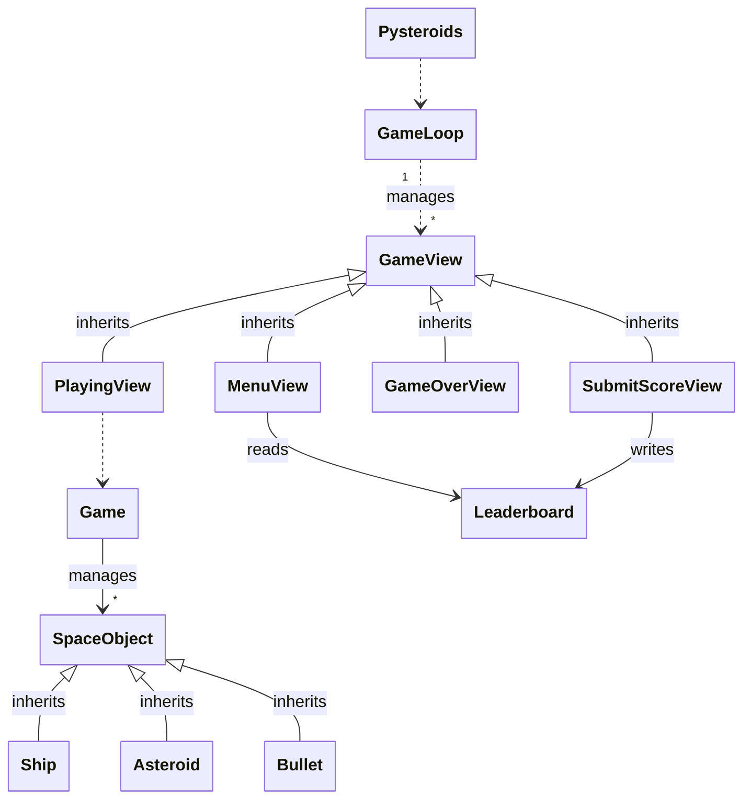
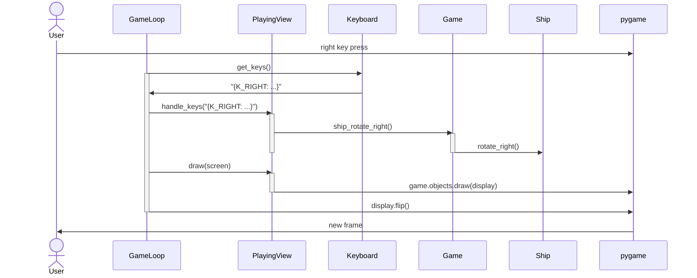

# Arkkitehtuurikuvaus

Pelin korkean tason arkkitehtuurikaavio on jotakuinkin seuraava. Pelin pääluokka
`Pysteroids` luo joukon pelitiloja (`GameState`), jotka vuorostaan edustavat
jotain pelin päänäkymää, ja pitävät huolta sekä syötteiden käsittelystä että
kyseisen tilan piirtämisestä. Varsinaisen pelin logiikan hallinta on keskitetty
`Game`-objektiin, eli tämä tietää kaikki käynnissä olevan pelin objektit ja
hallinnoi niiden liikehdintää, sekä pelaajan pistetilannetta yms. Pelin objektit
ovat kaikki `SpaceObject`-luokan aliluokkia.

## Tilanhallinta

Pelin ytimen eli itse pelin tilan hallinta on toteutettu luokalla `Game`, joka
ylläpitää kaikkien pelin objektien tilaa. Kyseinen luokka on ainoa, joka luo ja
poistaa pelin objekteja kuten asteroideja ja ammuksia. Myös kaikki interaktio
objektien kanssa hoidetaan tämän luokan läpi. Siis kun pelisilmukassa saadaan
vaikkapa tieto siitä, että kättäjä on painanut oikeaa nuolinäppäintä,
kääntymispyyntö pelaajan alukselle välitetään `Game`-oliolle, joka sitten
kääntää aluksen.

## Käyttöliittymä

Käyttöliittymän kontrollit ja piirtäminen toteutetaan näkymäluokilla kuten
`MenuView` ja `PlayingView`. Pelisilmukka hallinnoi siirtymiä eri näkymien
välillä, ja näkymät osaavat sitten piirtää itsensä ruudulle. Pelisilmukka myös
välittää kaikki syötteet (paitsi pelin sulkemispyynnöt) kulloinkin aktiiviselle
näkymälle.

## Päätoiminnallisuus

Pelin päätoiminnallisuus on käytännössä pelilogiikan hallinta, ja siitä
seuraavan tilan piirtäminen käyttäjälle. Jälkimmäisessä raskaan työn tekee
`pygame`, ja tätä hallinnoidaan aiemmin mainituilla näkymäluokilla.

Pelin suoritus etenee niin, että pääohjelma `Pysteroids`-objektin, joka
vuorostaan luo joukon olioita pelin tilalle, pelisilmukalle ja näkymille.
Suorituksen käynnistyttyä pelisilmukka kontrolloi näkymien vaihtoa, päivittää
näkymien tilaa ja piirtää näkymää kunnes peliohjelma suljetaan.

Kaikkien pygame-eventtien ja näppäimistön painallusten käsittely on
näkymäkohtaista, eli kukin `GameView`-objekti toteuttaa itse omien syötteidensä
käsittelyt. Näin siksi, että esimerkiksi välilyönnin painallus tuottaa eri
toiminnon eri näkymässä: pelinäkymässä se laukaisee pelaajan aluksen aseen,
mutta pelin loppunäkymässä se siirtää pelaajan leaderboard-lomakkeeseen.

### Esimerkki: laivan kääntäminen

Alla kuvattuna pääpiirteittäin sekvenssi siitä, miten käyttäjän antama
komento kääntää laivaa myötäpäivään käytännössä toteutuu.

Peli siis alustaa käynnistyessään kuuntelijan näppäimistölle (pygame tekee
automaattisesti), joka rekisteröi nuolinäppäimen painalluksen. Kun pelisilmukka
seuraavan kerran päivittää pelinäkymän tilaa, pelinäkymä tarkistaa painetut
näppäimet ja pyytää pelioliota kääntämään alusta oikealle. Peliolio kääntää
aluksen, ja seuraavan kerran kun pelinäkymä piirtää itsensä, alus on kääntynyt.

## Ohjelman rakenteelliset heikkoudet

Ei ole välttämättä clean code -henkinen ratkaisu, että näkymät sekä
kontrolloivat syötteiden käsittelyä että piirtävät itsensä. Kuitenkin, peli on
sen verran yksinkertainen, että _tässä vaiheessa_ kehityskaarta tämä ratkaisu
tuntuu varsin järkevältä.

Myös aktiivista näkyvää hallinnoiva tilakone olisi voinut olla oma luokkansa,
mikä helpottaisi sen testaamista. Toistakseksi siirtymiä testataan
pelisilmukka-olion kautta.

Pelin kasvaessa voisi olla myös mielekästä eriyttää peliobjektien ydinlogiikka
kokonaan pygamen `Sprite`-luokasta, niin että esimerkiksi `Ship` pitäisi
sisällään vain aluksen sijainnin ja suunnan ynnä muun olennaisen, ja tuon tilan
piirtäminen hoidettaisiin sitten jossain täysin erillisessä
`ShipSprite`-luokassa. Toistaiseksi tästä ei oikein olisi vaikuttanut olevan
suurta hyötyä.
