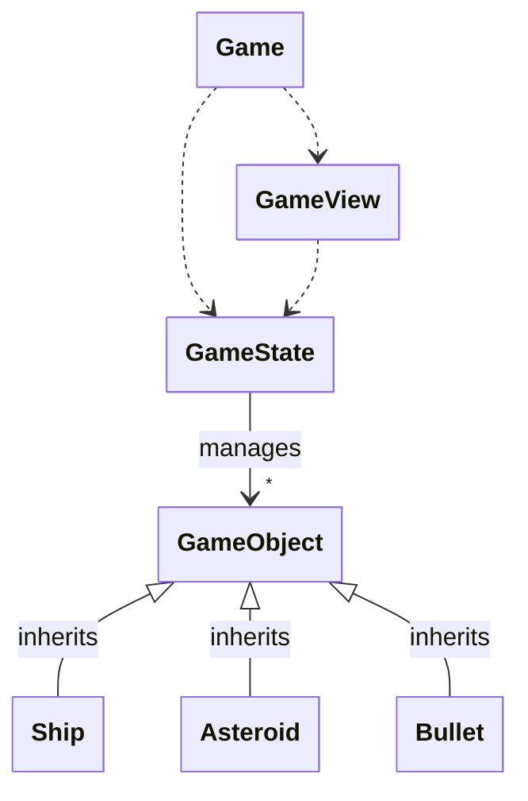
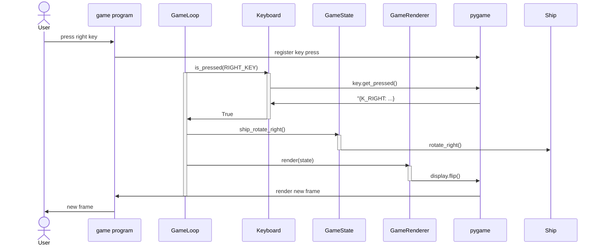

# Arkkitehtuurikuvaus

Pelin korkean tason arkkitehtuurikaavio on jotakuinkin seuraava. Pelin pääluokka
`Game` (jota tosin toistaiseksi sijaistaa pääohjelman koodi) hallinnoi pelin
tilaa `GameState` ja pelin näkymää `GameView`, joista ensimmäinen ylläpitää
pelin logiikkaa (yhdessä pelissä olevien objektien kanssa) ja jälkimmäinen
hoitaa pelin piirtämisen näytölle. Esimerkiksi pakkausjako muotoutuu projektin
edetessä, ja peliin saattaa tulla myös lisää objekteja. Korkean tason idea
kuitenkin on tämä.

## Päätoiminnallisuus

Pelin päätoiminnallisuus on käytännössä pelilogiikan hallinta, ja siitä
seuraavan tilan piirtäminen kääyttäjälle. Jälkimmäisessä raskaan työn tekee `pygame`.

Pelin suoritus etenee niin, että pääohjelma alustaa `pygame`-instanssin, ja luo
sen jälkeen joukon olioita (GameState, GameRenderer, GameLoop), jotka
hallinnoivat pelin suoritusta, eli pelin tilan hallintaa ja ruudunpäivitystä.

Alla kuvattuna pääpiirteittäin sekvenssi siitä, miten käyttäjän antama
komento kääntää laivaa myötäpäivään käytännössä toteutuu.

