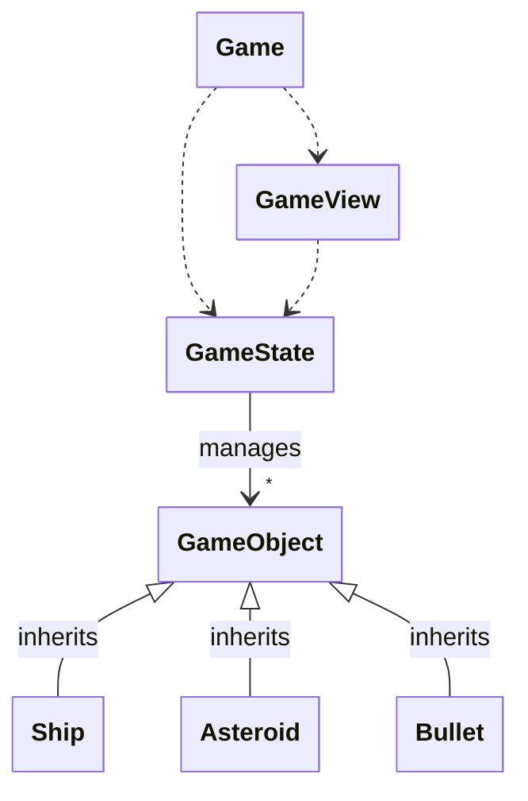

# Arkkitehtuurikuvaus

Pelin korkean tason arkkitehtuurikaavio on jotakuinkin seuraava. Pelin pääluokka
`Game` (jota tosin toistaiseksi sijaistaa pääohjelman koodi) hallinnoi pelin
tilaa `GameState` ja pelin näkymää `GameView`, joista ensimmäinen ylläpitää
pelin logiikkaa (yhdessä pelissä olevien objektien kanssa) ja jälkimmäinen
hoitaa pelin piirtämisen näytölle. Esimerkiksi pakkausjako muotoutuu projektin
edetessä, ja peliin saattaa tulla myös lisää objekteja. Korkean tason idea
kuitenkin on tämä.

