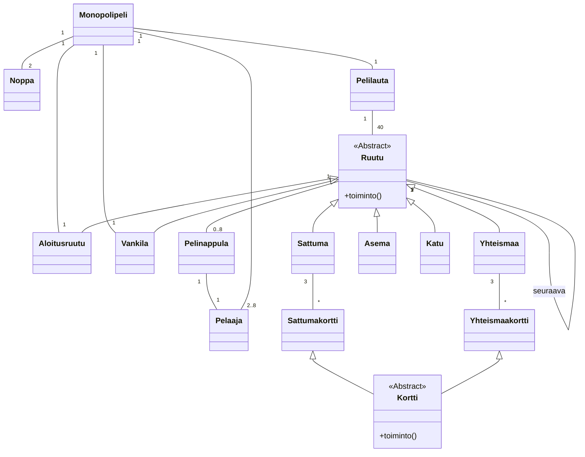

# Luokkakaavio Monopoli-pelille

```mermaid
classDiagram
    Monopolipeli "1" -- "2" Noppa
    Monopolipeli "1" -- "1" Pelilauta
    Monopolipeli "1" -- "1" Aloitusruutu
    Monopolipeli "1" -- "1" Vankila
    Pelilauta "1" -- "40" Ruutu
    Ruutu "1" -- "1" Ruutu : seuraava
    Ruutu "1" -- "0..8" Pelinappula
    Pelinappula "1" -- "1" Pelaaja
    Pelaaja "2..8" -- "1" Monopolipeli
    Sattuma "3" -- "*" Sattumakortti
    Yhteismaa "3" -- "*" Yhteismaakortti

    Ruutu <|-- Aloitusruutu
    Ruutu <|-- Vankila
    Ruutu <|-- Sattuma
    Ruutu <|-- Yhteismaa
    Ruutu <|-- Asema
    Ruutu <|-- Katu

    Sattumakortti <|-- Kortti
    Yhteismaakortti <|-- Kortti

    class Ruutu
    <<Abstract>> Ruutu
    Ruutu : +toiminto()

    class Kortti
    <<Abstract>> Kortti
    Kortti : +toiminto()
```
